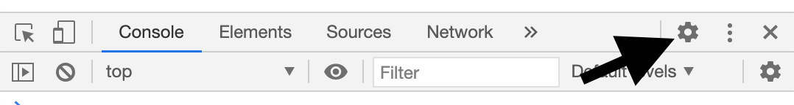
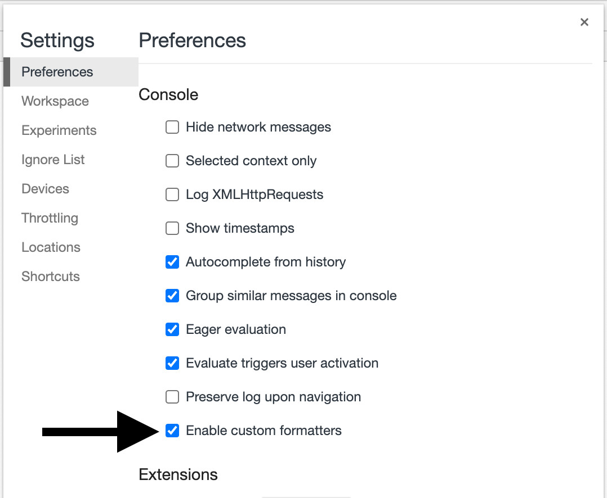
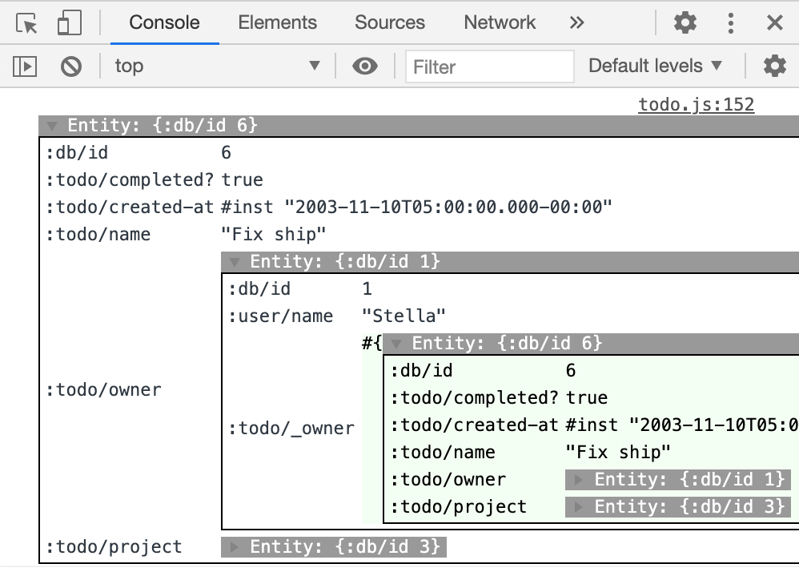

# Homebase React

[](https://github.com/homebaseio/homebase-react/actions?query=workflow%3ACI)
[](https://github.com/homebaseio/homebase-react/actions?query=workflow%3ACD)
[](https://www.npmjs.com/package/homebase-react)
[](https://www.npmjs.com/package/homebase-react)
[](LICENSE)

*The React state management library for write-heavy applications*

## What and Why

As data and our need to annotate and organize it grows, so does our need for supporting state in *write-heavy* applications.

To solve this problem, modern write-heavy applications such as Superhuman, Roam Research, and Facebook Messenger built their own embedded data layers to enable these more sophisticated user experiences. 

Homebase-react enables developers to access the same embedded datalog database as Roam Research through React hooks. You no longer have to build out a team or learn specialized tools like Clojure in order to build a delightful write-heavy application.


## Testimonials
> Homebase is executing on the vision of data usage, portability, and management we had when building Firebase. We never got there. I'm excited!
>
> —James Tamplin, Founder/CEO of Firebase

> Datalog is the future of end-user programming, personal productivity software, p2p software, etc.
>
> —Chet Corcos, Founding Engineer of Notion

## Install

```bash
# NPM
npm install homebase-react --save

# Yarn
yarn add homebase-react
```

## Docs
https://homebase.io/docs/homebase-react


## Examples
### Live Demos
You can see our hosted live demos [here](https://homebaseio.github.io/homebase-react)

### Code Examples
You can clone and run our React code examples [here](examples/).

## API Overview

### `HomebaseProvider`

The HomebaseProvider wraps your React app and makes a relational database accessible to all of your components. Configure it with `lookupHelpers` and `initialData`.

```js
import { HomebaseProvider, useEntity, useTransact, useQuery } from 'homebase-react'

const config = {
  // Lookup helpers simplify relational queries at query time.
  // The helpers currently supported are:
  // `type: 'ref'` which is a relationship and
  // `unique: 'identity` which enforces a uniqueness constraint 
  // and lets you lookup entities by their unique attributes.
  lookupHelpers: {
    todo: {
      project: { type: 'ref', cardinality: 'one' },
      name: { unique: 'identity' }
    }
  },
  
  // Initial data is what it sounds like.
  // It's a transaction that runs on component mount.
  // Use it to hydrate your app.
  initialData: [
    { project: { id: -1, name: 'Do it', user: -2 } },
    { todo: { project: -1, name: 'Make it' } },
    { user: { id: -2, name: 'Arpegius' } }
  ]

  // Or relationships can be specified implicitly with nested JSON
  initialData: [
    { 
      todo: { 
        name: 'Make it',
        project: { 
          name: 'Do it', 
          user: { 
            name: 'Arpegius' 
          } 
        } 
      } 
    }
  ]
}

const RootComponent = () => (
  <HomebaseProvider config={config}>
    <App/>
  </HomebaseProvider>
)
```

### `useEntity` and `entity.get`

Entities are the building blocks of the Homebase data model. They are like JSON objects with bonus features. In particular **you can traverse arbitrarily deep relationships without actually denormalizing and nesting your data**.

```js
// You can get an entity by its id and get attributes off of it.
const [todo] = useEntity(2)
todo.get('id') // => 2
todo.get('name') // => 'Make it'

// Entities with unique attributes can also be retrieved by those attributes.
const [sameTodo] = useEntity({ todo: { name: 'Make it' } })
sameTodo.get('id') // => 2

// And most importantly you can traverse arbitrarily deep relationships.
sameTodo.get('project', 'user', 'name') // => 'Arpegius'
```

### `useTransact`

Transactions let you create, update and delete multiple entities simultaneously. All changes will reactively update any components that depend on the changed data.

```js
const [transact] = useTransact()

// A transaction is an array of nested objects and or arrays.
// Leaving the id blank will create a new entity.
transact([{ todo: { name: 'New Todo', project: 1 } }])

// Setting the id to a negative number is a temp id which 
// allows multiple entities to be related to each other on creation.
transact([
  { project: { id: -123, name: 'New Project' } },
  { todo: { project: -123, name: 'New Todo' } },
])

// Update an entity by including its id.
// NOTE: that only the included attributes will be updated.
transact([{ project: { id: 1, name: 'Changed Project Title' } }])

// To remove an attribute you have to explicitly set it to null.
transact([{ project: { id: 1, name: null } }])

// To delete an entire entity use retractEntity and its id
transact([['retractEntity', 1]])
```

### `useQuery`

Use queries to return an array of entities that meet a given criteria. Our query API is powered by Datalog, but exposed as JSON similar to a JS SQL driver or MongoDB. Datalog is similar to SQL and is incredibly powerful. However, only a subset of features are currently available in JSON.

We will prioritize features based on community feedback so please open an issue if there's something you need. In the meantime you can further filter results with JS `filter()` and `sort()`.

```js
// Finds all todos with a name
const [todos] = useQuery({
  $find: 'todo',
  $where: { todo: { name: '$any' } }
})

// Returns an array of todo entities
todos
.sort((todo1, todo2) => todo1.get('name') > todo2.get('name') ? 1 : -1)
.map(todo => todo.get('name'))
```

### `useClient`

This hook returns the current database client with some helpful functions for syncing data with a backend.

- `client.dbToString()` serializes the whole db including the lookupHelpers to a string
- `client.dbFromString('a serialized db string')` replaces the current db
- `client.dbToDatoms()` returns an array of all the facts aka datoms saved in the db
    - datoms are the smallest unit of data in the database, like a key value pair but better
    - they are arrays of `[entityId, attribute, value, transactionId, isAddedBoolean]`
- `client.addTransactListener((changedDatoms) => ...)` adds a listener function to all transactions
    - use this to save data to your backend
- `client.removeTransactListener()` removes the transaction listener
    - please note that only 1 listener can be added per useClient scope
- `client.transactSilently([{item: {name: ...}}])` like `transact()` only it will not trigger any listeners
    - use this to sync data from your backend into the client

Check out the [Firebase example](https://homebaseio.github.io/homebase-react/#!/example.todo_firebase) for a demonstration of how you might integrate a backend.

##  Debugging tips

### Custom chrome formatters
If you develop with [Chrome](https://www.google.com/chrome/) or a Chromium browser like Brave or Edge you'll get significantly more meaningful logs for entities `console.log(anEntity)` due to our use of custom chrome :formatters. These custom formatters allow us to perform lazy database queries to fetch all of an entity's attributes, including references to other entities and all reverse references to the current entity. They give you full access to your data graph with any entity as an entry point.

#### To enable chrome custom formatters
**1.** Open the preferences panel in chrome devtools by clicking the cog.



**2.** Toggle `Enabled custom formatters` on.



**3.** Keep the chrome console open and refresh the page. Any logged out entities should now have the custom formatting.



**Live demo:** open the console while on the [todo example](https://homebaseio.github.io/homebase-react/#!/dev.example.todo) page.

**Remember**: for custom formatters to work `console.log(anEntity)` must be called *after* you open the chrome console. Anything logged out before you open the console will not have custom formatting applied because chrome processes those logs in the background.

### *DEPRECATED* `_recentlyTouchedAttributes`

*Use [custom chrome formatters](#custom-chrome-formatters) instead.*

If you set `debug` to `true` in your configuration, you will be able to access the `_recentlyTouchedAttributes` attribute on entities. `_recentlyTouchedAttributes` will show any cached attributes for a given entity. This is helpful for approximating that entity's schema and values.

```js
  <HomebaseProvider config={{ debug: true }}>
    <App/>
  </HomebaseProvider>
```

## Roadmap

1. Improve developer tools: custom chrome formatters, DB admin console extension
2. Rewrite React ↔ Homebase cache
    1. Support async DB access (for Datahike)
    2. Reactive query planning (better perf on pages with lots of live reads)
3. Swap [Datascript](https://github.com/tonsky/datascript) out for [Datahike](https://github.com/replikativ/datahike)
    1. Immutability
    2. History / Change Tracking
4. Persist to IndexedDB
5. [Local-first](https://www.inkandswitch.com/local-first.html) conflict resolution for offline caching and sync between multiple devices

## Limitations
Homebase React is currently not a good choice for read-heavy applications (e.g. Twitter, ecommerce). We plan to support these query patterns with our [platform](http://homebase.io) eventually.

## Development

```bash
yarn install
yarn dev
```

Open http://localhost:3000

## Test

```bash
yarn install
yarn test
```

## Contributing

Welcome and thank you! Writing docs, patches and features are all incredibly helpful and appreciated.

We only ask that you provide test coverage for code changes, and conform to our [commit guidelines](CONTRIBUTING.md).

## Authors

- Chris Smothers ([@csmothers](https://twitter.com/csmothers)) – [Homebase](https://www.homebase.io/)
- JB Rubinovitz ([@rubinovitz](https://twitter.com/rubinovitz)) – [Homebase](https://www.homebase.io/)
